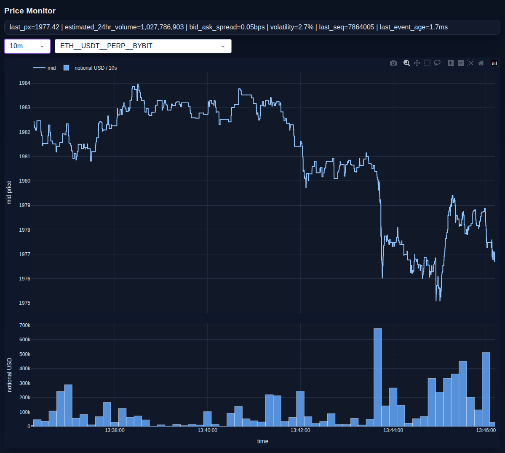

# sgt-dashboard

Dash-based monitoring dashboard for real-time market data streamed from exchanges and published into SGT shared memory.

## Package contents

- `sgt_dashboard/shm_direct_price_reader.py`: direct SysV SHM reader that streams decoded events.
- `sgt_dashboard/shm_dash_app.py`: Dash UI for live bid/ask/trade/notional monitoring.

## Install

```bash
cd <your-repo-root>/sgt-dashboard
python3 -m pip install -e .
```

## Run dashboard

```bash
sgt-shm-dash \
  --pathname <shm-pathname> \
  --refdata <path-to-refdata>/refdata.latest.json \
  --host 127.0.0.1 \
  --port 8060 \
  --title "Price Monitor"
```

## Run reader directly

```bash
sgt-shm-reader --pathname <shm-pathname> --refdata /path/to/refdata.json
```

## Notes

- The dashboard polls the reader stream on a Dash interval (`500ms` by default).
- Volatility is computed from the 10-minute mid-price series and shown in percent.
- Estimated 24-hour volume is extrapolated from the latest 10-minute notional series.


## Screenshots

### BTC BYBIT 1m

<p>
  
</p>

### ETH BYBIT 10m

<p>
  
</p>

## Testing

```bash
cd <your-repo-root>/sgt-dashboard
python3 -m pip install -r requirements.txt
python3 -m pytest -q
```
